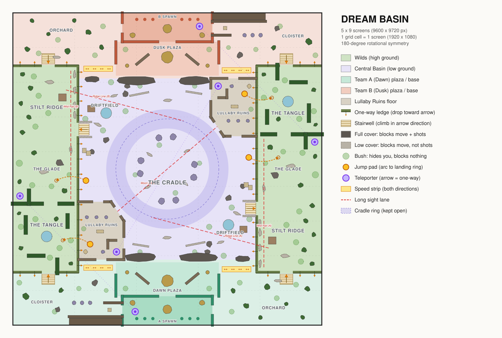

# Dream Basin: blockout

- **Size:** 5 × 7.5 screens = 9600 × 8100 px (one screen = the 1920 × 1080 viewport at zoom 1).
- **Symmetry:** exact 180° rotation about the map centre. Team A (Dawn, mint) spawns at the bottom and Team B (Dusk, coral) at the top.
- **Source of truth:** `tools/dream_basin/layout.py`. Run `render_svg.py` to redraw this image and `check.py` to validate it.

Walk speed is 650 px/s and the actor body is about 128 px, so crossing one screen horizontally takes about 3 s. A straight run from spawn to spawn takes about 12 s.

## Regions

| Region | Where | Role |
|---|---|---|
| **The Cradle** | Basin centre, low ground | The main arena and the Sleepwalker's home. It has a clear oval circuit (600 px wide, verified collision-free) around a ring of broken pillars. |
| **Lullaby Ruins** | Basin corner (A: lower-left, B: upper-right) | A collapsed chapel with three doors and rooms. **CQC.** It holds the Dream Rift teleporter and an updraft pad up to the Tangle. |
| **Driftfield** | Basin corner (A: lower-right, B: upper-left) | An open field of rocks and tall grass under the Ridge. Mid-range fights. |
| **The Wilds** | Both flanks, high ground | Each Wild has three thirds (below). One-way ledges separate them from the basin. |
| ↳ **The Tangle** | The Wild third nearest your own base on the left | A hedge maze. Hedges block shots. **CQC.** Your wild bell is here. |
| ↳ **The Glade** | Middle of each Wild | A mid-range meadow. Your spawn teleporter exits here. |
| ↳ **Stilt Ridge** | The Wild third nearest your own base on the right | Open high ground, the sniper perch. The enemy's wild bell is here. |
| **Dawn / Dusk Plaza** | In front of each base | The staging area. A sundial landmark blocks the view into the spawn door. |
| **Cloister** | Base outskirts on the Tangle side | A tight walled tunnel (**CQC**) that opens into a colonnade and then the Tangle stairwell. |
| **Orchard** | Base outskirts on the Ridge side | Open scattered trees leading to the Ridge stairwell. |

## Sight lines (all verified clear by `check.py`)

| Lane | Length | Counterplay |
|---|---|---|
| Moon Aisle: Ruins A east door → Cradle centre → Ruins B | 2.25 screens | Pillar ring off-axis. Step out of the diagonal. |
| Ridge Line ×2: Ridge perch → across the lower Driftfield into the Cradle | 1.95 screens | Stairwell and flank approach, below. |
| Wild Rail ×2: along the inside lip of each Wild, Ridge → Glade | 1.74 screens | The Tangle hedges stop it; the Glade trees break it. |

No lane reaches a spawn door. The longest clear ray out of any spawn door is 1.8 screens, and it runs along a shallow angle through the Orchard.

## Close quarters
The Lullaby Ruins (×2), the Tangle (×2) and the Cloister tunnel (×2).

## Chokes and alternatives
- **Cradle Steps** (640 px gap between two rock masses) is the direct route from the plaza to the Cradle. The alternatives are the Ruins (slower, CQC) and the Driftfield gate (open, covered by the Ridge).
- **Stairwells into the Wilds** (350–400 px, railed): the alternatives are the jump pads (committal, visible arc) or the spawn teleporter.
- **Ruins doors:** the alternatives are the Dream Rift, or dropping in from the Tangle.

## Every strong position has a counter
- **Stilt Ridge perch:**
  - The basin stairwell comes up right beside it. That route is fast but exposed.
  - A tree line along the outer wall lets a flanker approach from the Glade.
  - The enemy's spawn teleporter drops them in the Glade behind the Ridge.
  - The sniper can drop to the basin for free, but has to walk back to a stairwell.
- **Tangle:** you can drop off its cliff into the Ruins courtyard, and the Ruins Updraft brings you back up.

## Rotation paths (left ↔ right for one team)
1. **Across the Cradle:** fastest, and exposed to the Moon Aisle and both Ridges.
2. **Back road:** behind your own choke (Ruins south door → plaza → Driftfield gate), with speed strips on both ends. Safe, but longer.
3. **Spawn → Dawn/Dusk Door:** a one-way teleporter from spawn to the left Glade. It's a comeback route and flanks the enemy Ridge.
4. **Dream Rift:** a two-way teleporter between the two Ruins. It's a cross-map flank that lands you in enemy territory.

## Mobility objects
- **Jump pads (4):**
  - Glade Spring: basin → Glade.
  - Ruins Updraft: Ruins courtyard → Tangle.
  - Each has a rotated copy.
- **Teleporters:**
  - Dream Rift: a two-way pair.
  - Dawn Door and Dusk Door: one-way, from spawn out to the Glade.
- **Speed strips (Lamplight Road):** four strips on the back road beside each plaza. They boost movement along their axis in both directions.
