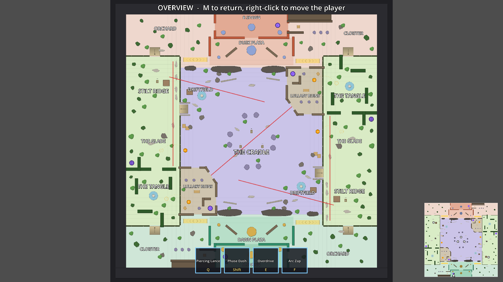

# Dream Basin

A test map for movement and fighting.

- **Size:** 5 × 9 screens = 9600 × 9720 px. One screen is the 1920 × 1080 viewport at zoom 1.
- **Symmetry:** exact 180° rotation about the centre. Team A (Dawn, mint) spawns at the bottom, Team B (Dusk, coral) at the top.
- **Travel time:** walking at 540 px/s, spawn to spawn in a straight line takes about 18 s.
- **Play it:** `scenes/dream_basin_world.tscn` is the main scene.
  - **M** toggles the whole-map overview.
  - In overview, **right-click** moves the player to that spot.

Blockout with legend: [dream_basin_blockout.svg](dream_basin_blockout.svg)

## Regions

| Region | Where | Role |
|---|---|---|
| **The Cradle** | Basin centre, low ground | The main arena. An open oval ring (600 px wide, collision-free) circles a broken pillar ring. It is kept clear for whatever the objective becomes. |
| **Lullaby Ruins** | Basin corner (A: lower-left, B: upper-right) | Roofless chapel (1400 × 1800 px). Four ways in: north door, a collapsed corner facing the Cradle, east door, south door, plus dropping in from the Tangle. The inside is roomy: a pillar colonnade, a courtyard with the updraft, and a side chapel with the Dream Rift. **Enclosed.** |
| **Driftfield** | The other two basin corners | Open field under the Ridge, with a fountain and a ruined gatehouse. Mid-range. |
| **The Tangle** | Wild third nearest your base (left side for A) | Walled hedge garden. Its perimeter hedges block shots, so you have to come inside to fight. Inside are loose rooms around a fountain, with lanes of 450 px or more. **Enclosed.** |
| **The Hollow** | Pocket on the outer wall between Tangle and Glade | Hidden exit of your one-way spawn teleporter. |
| **The Glade** | Middle of each Wild | Mid-range meadow. |
| **Stilt Ridge** | The other end of each Wild | Open high ground. The sniper perch is a stilt hut behind a row of low rocks. |
| **Dawn / Dusk Plaza** | In front of each base | Staging area. The sundial and broken walls block every diagonal into the spawn door. |
| **Cloister** | Base outskirts, Tangle side | Walled tunnel (**close-quarters**) that opens into a colonnade. |
| **Orchard** | Base outskirts, Ridge side | Open scattered trees. |

## Sight lanes

All lanes are verified clear by `check.py`.

| Lane | Length |
|---|---|
| Moon Aisle (diagonal through the Cradle) | 2.5 screens |
| Ridge Line ×2 (perch → Driftfield → Cradle) | 2.0 screens |
| Wild Rail ×2 (along the cliff lip, Ridge → Glade) | 2.1 screens |

No lane reaches a spawn door. The longest clear ray out of any spawn door is about 2 screens, at a shallow angle.

## Movement and body

The shared values live in `scenes/actor.tscn`, in the MovementComponent node.

| | Before | Now |
|---|---|---|
| Top speed | 650 px/s | 540 px/s |
| Acceleration | 1600 (0.4 s to full speed) | 2600 (about 0.2 s) |
| Friction | 1400 (about 150 px slide) | 2800 (about 50 px slide) |
| Collision body | 129 × 127 box | Circle, radius 50 |

Momentum still exists. Knockback, dash carry and speed strips all go through the same acceleration and friction, but you stop where you meant to.

**Why the circle matters:** a round body glides around corners instead of catching on them. On top of that, `wall_min_slide_angle = 0` makes you slide along walls even when pushing almost straight into them.

**Visual size:** the player's sprite is drawn at 0.8× (`body_scale` in `player_visuals.tres`).

**Knock-on for enemies:** enemies inherit the higher friction, so knockback pushes them a shorter distance than before.

## Minimap

`scenes/hud/minimap.tscn` sits in the bottom-right corner. It builds itself from whatever `GameMap` is loaded, so it needs no per-map setup.

- **Static layer**, drawn once from the map's own nodes: floors, cover, ledges, jump pads, teleporters, speed strips.
- **Dynamic layer**, redrawn every frame:
  - A white arrow for you.
  - A rectangle showing what the camera currently sees.
  - Dots for every node in the `minimap_units` group. Actors and training dummies join that group automatically.
- **Dot colours** compare each unit's `team` with yours: same team = ally (teal), other team = enemy (red), no team = neutral (grey).
  - `Actor` now has a `team` export: the player is `a`, the enemy is `b`.
- **Objectives:** add any node to the `minimap_objectives` group and it appears as a diamond. It's gold if it has no owner, and coloured by team if it has a `team` property.

## How the systems work

### Collision layers

| Layer | Name | Blocks characters | Blocks shots | Used by |
|---|---|---|---|---|
| 1 | World | yes | yes | Walls, rocks, trees, hedges, map boundary |
| 6 | Low Cover | yes | no | Low walls, crates, low rocks |
| 7 | Ledges | only when climbing | no | Cliff edges |

- **Characters** (`actor.tscn`) mask layers 1, 6 and 7. The player also masks layer 2, so it collides with other characters.
- **Projectiles** only mask layer 1 plus hurtboxes, so they fly over low cover and ledges.
- **Arc Zap** checks line of sight against layer 1 only, which matches the projectiles.
- The bit values are named in `scripts/map/map_layers.gd`.

### One-way ledges

Scene: `scenes/map/ledge.tscn`. Script: `scripts/map/ledge.gd`.

- **Shape:** a thin strip on layer 7 with Godot's `one_way_collision` turned on.
- **Why it's one-way:** a one-way shape only stops bodies moving along its local +Y axis.
- **How it's placed:** the ledge is rotated so its local +Y points from low ground toward high ground.
  - Walking toward the high ground is blocked.
  - Walking toward the low ground passes through.
- **Forced moves obey it too:** dashes and knockback go through the same `move_and_slide`. So Melody's pull can drag someone *off* a cliff, but it can't drag them *up* one.
- **Stairwells** are just gaps left between ledges. `stairwell.tscn` only draws the steps.
- **To add one:** drop a Ledge scene into the map, set `length`, and rotate it so the chevrons point at the low ground.

### Jump pads

Scene: `scenes/map/jump_pad.tscn`. Script: `scripts/map/jump_pad.gd`.

- **Trigger:** an `Area2D` that notices a character stepping on and calls `Actor.launch(landing, air_time, arc_height)`.
- **The flight** (`launch()` is in `scripts/actor.gd`):
  1. A timed forced move carries the body in a straight line (the same mechanism as the dash).
  2. During the flight, layers 6 and 7 are removed from the character's collision mask. That's what lets a pad carry you up a cliff or over low cover. Walls still stop you.
  3. The arc is visual only: the `Visuals` node lifts and grows, and a shadow stays on the ground.
- **Landing:** the pad lands you exactly on its landing ring with no slide. The mask bits are then restored.
- **No abilities mid-air:** `Ability.try_activate` refuses while airborne, so a dash can't replace the arc. Shooting still works.
- **To add one:** drop the scene and set `landing_offset`, which is in the pad's local space. The landing ring and dotted flight path are always drawn, so everyone can read where the pad goes.

### Teleporters

Scene: `scenes/map/teleporter.tscn`. Script: `scripts/map/teleporter.gd`.

- **Setup:** place two and set each one's `partner` to the other.
- **`mode`:**
  - `TWO_WAY` on both ends of a normal pair.
  - `SEND_ONLY` + `RECEIVE_ONLY` for a one-way link.
- **Using it:**
  1. Stand on a sending pad for `channel_time` seconds. Stepping off cancels.
  2. While you channel, the destination pad flashes collapsing rings. That's the exit telegraph, so defenders see arrivals coming.
  3. After a teleport, **both** ends rest for `cooldown` seconds. Someone who has just arrived is ignored until they step off, so there's no ping-pong.
- **Current tuning:**
  - **Dream Rift** (Ruins ↔ Ruins): 0.75 s channel, 4 s shared cooldown. Only one player crosses at a time, so the exit can be held.
  - **Dawn / Dusk Door** (spawn → Hollow, one-way): 0.35 s channel, no cooldown, so a whole team can use it.

### Speed strips

Scene: `scenes/map/speed_strip.tscn`. Script: `scripts/map/speed_strip.gd`.

- **Registration:** on enter, the strip registers itself with the character's `MovementComponent` (`add_speed_zone`).
- **The boost:** each frame, the component calls `boost_velocity()` on the target velocity. That multiplies only the part of your movement along the strip's axis, in either direction. Acceleration scales by the same multiplier.
- **Other zones:** any node with `boost_velocity()` and `multiplier` works. For example, a mud patch with a multiplier below 1 would slow people down.

### Cover, bushes and the debug view

Natural pieces are drawn smaller than authored, controlled by `SHRINK` in `layout.py`: trees 0.72×, rocks 0.75×, bushes 0.72×. Some rocks were reflavoured:
- **Fountains:** low-cover basin (you can shoot across the water) with a full-cover statue in the middle.
- **Buildings:** small full-cover footprints. The Driftfield gatehouse and the Stilt Ridge hut are buildings.

- **Cover** (`CoverBody`, `scripts/map/cover_body.gd`): a `StaticBody2D` whose `CollisionPolygon2D` child is its shape.
  - Edit the polygon in the editor and the drawing follows.
  - `height` FULL or LOW picks the layer and the look.
  - `scenes/map/cover_block.tscn` is a blank block you can drop in.
- **Bushes** (`bush.tscn`): block nothing. They draw over characters and fade while the player is inside.
- **Debug view** (`MapDebugView`, `scripts/map/map_debug_view.gd`):
  - Detaches the player's camera and tweens it to fit `GameMap.bounds`.
  - Shows the `map_overview` group: region names and sight lanes.

## Where the layout comes from

`tools/dream_basin/layout.py` is the source of truth. You hand-author one half, and it is rotated to make the other half.

| File | What it does |
|---|---|
| `check.py` | Validates the layout: lanes are clear, pads have standable landings, 128 px bodies can reach everything, one-way cliffs only open via stairs or pads, spawn door exposure. |
| `render_svg.py` | Redraws the blockout image. |
| `export_godot.py` | Writes `scenes/maps/dream_basin.tscn` and `scenes/dream_basin_world.tscn`. **Re-exporting overwrites hand edits to the map scene.** |
| `smoke_test.tscn` | Runs the real player through ledges, pads, teleporters, strips and projectile layers. Run it with `godot --headless res://tools/dream_basin/smoke_test.tscn`. |
| `screenshots.tscn` | Renders review shots. Needs a display. |

To make the map bigger or smaller, change `SY` (vertical stretch) in `layout.py`. It moves positions, not sizes.
