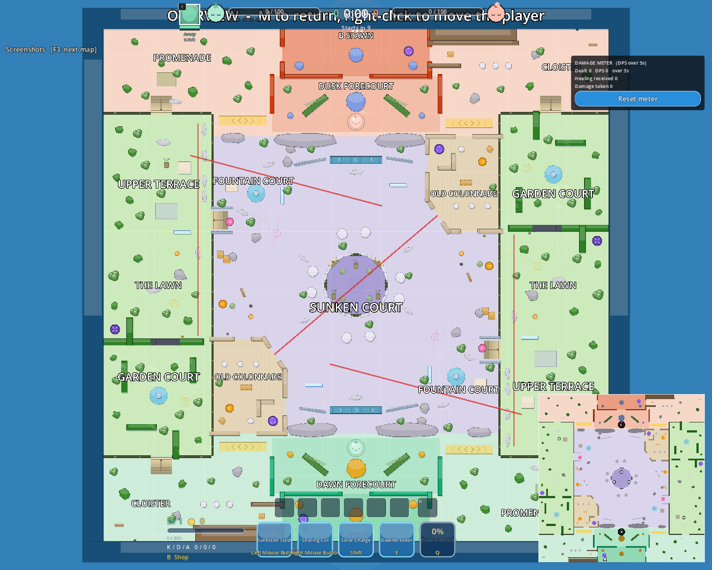

# Dream Basin

A test map for movement and fighting.

- **Size:** 5 × 9 screens = 9600 × 9720 px. One screen is the 1920 × 1080 viewport at zoom 1.
- **Symmetry:** exact 180° rotation about the centre. Team A (Dawn, mint) spawns at the bottom, Team B (Dusk, coral) at the top.
- **Travel time:** walking at 540 px/s, spawn to spawn in a straight line takes about 18 s.
- **Play it:** `scenes/dream_basin_world.tscn` is the main scene.
  - **M** toggles the whole-map overview.
  - In overview, **right-click** moves the player to that spot.

Blockout with legend: [dream_basin_blockout.svg](dream_basin_blockout.svg)

## Regions

Dream Basin is dressed as an open-air plaza (Map Liveliness Plan > Plaza
direction). The table gives each region's plaza name and, in brackets, its
old name: code, `layout.py` comments and DreamZone `pair_id`s still use the
old names (`glade`, `ridge`, `tangle`, `ruins`, `driftfield`, `orchard`).

| Region | Where | Role |
|---|---|---|
| **The Sunken Court** (the Cradle) | Basin centre | The main arena. An oval ring (600 px wide) circles a ring of marble columns; the Ruined Arcs (below) split it into an inner and an outer track. Inside it the court itself sits one step down (radius 600 px), with the Nightmare's lair and the Dream Mote spot on its floor. Its rim is a stone balustrade (low cover: shoot over it), broken by eight staircases, on the diagonals and the axes, all walkable both ways. Two pairs of planters on the floor. |
| **The Old Colonnade** (Lullaby Ruins) | Basin corner (A: lower-left, B: upper-right) | A sandstone arcade under restoration (1400 × 1800 px). Four ways in: the north gate, a collapsed corner facing the court, east door, south door, plus dropping in from the Garden Court. Inside: a row of columns, a courtyard with the updraft, and a side chapel with the Dream Rift. **Enclosed.** |
| **The Fountain Court** (Driftfield) | The other two basin corners | Open paved court under the Upper Terrace, with a fountain and a pavilion. Mid-range. |
| **The Garden Court** (the Tangle) | Wild third nearest your base (left side for A) | Walled hedge garden. Its perimeter hedges block shots, so you have to come inside to fight. Inside are loose rooms around a fountain, with lanes of 450 px or more. **Enclosed.** |
| **The Hollow** | Pocket on the outer wall between the Garden Court and the Lawn | Hidden exit of your one-way spawn teleporter. |
| **The Lawn** (the Glade) | Middle of each Wild | Mid-range lawn with garden boulders. The Lawn Stairs climb to it from the basin. |
| **The Upper Terrace** (Stilt Ridge) | The other end of each Wild | Open high ground overlooking the plaza. The sniper perch is a pavilion behind a row of low stones. |
| **Dawn / Dusk Forecourt** (Plaza) | In front of each base | Staging area. The sundial and two hedge planters block every diagonal into the spawn door. |
| **Cloister** | Base outskirts, Garden Court side | Walled tunnel (**close-quarters**) that opens into a colonnade. |
| **The Promenade** (Orchard) | Base outskirts, Terrace side | Tree-lined walk. |

## Shops and neutral camps

Placed by `tools/dream_basin/layout.py` (and checked by `check.py`: clear of
cover, reachable on foot, mirrored).

| What | Where |
|---|---|
| **Shop** (one per team) | In the spawn room, behind the spawn points. |
| **The Nightmare's lair** | The Cradle's centre (the Dream Mote spot too; the Nightmare's body is small enough to reach a Mote under it). |
| **Sleepwalker** ×4 | Each Glade and each Stilt Ridge. |
| **Dream Wisps** ×4 | Each Tangle and each Driftfield. |

| **Dream-glass** ×6 | Between each Plaza's Reflecting Pools (the avenue into the Cradle), at each Driftfield's inner edge, on each Glade/Ridge border (`scenes/map/breakable_cover.tscn`). |
| **Mote geyser** ×4 | Each Glade and each Cradle rim (`scenes/map/mote_geyser.tscn`). |
| **Toggle gate** ×4 | Each Lullaby Ruins' north door and each Tangle's main entrance, with a lever outside (`scenes/map/toggle_gate.tscn`). |
| **Sleep-fog** ×2 / **Thorn bed** ×2 | Each Stilt Ridge / each Orchard (`scenes/map/hazard_zone.tscn`). |
| **Travelator** ×2 | The Plaza Express, along each Plaza front (`scenes/map/travelator.tscn`). |
| **Water stairs** ×2 | Each Fountain Court, running down toward the Sunken Court (`scenes/map/water_stairs.tscn`): x1.45 going down, x0.6 climbing. |
| **Launch flower** ×2 | Each Fountain Court's inner edge, landing on the Cradle's inner terrace (`scenes/map/jump_pad.tscn` with a sweep). No pad or flower sits within 400 px of a stairwell (`check.py`), so walking up stairs never launches you. |

## Getting around on foot

Every area can be reached by walking, from either base, and walked back
out of; `check.py` (Walking) and `bot_nav_test` both prove it with every
jump pad, launch flower and teleporter removed. Pads and teleporters are
only shortcuts.

- **Each Wild** is high ground behind a cliff (chevrons point down it). Four
  staircases climb it: two up from the basin, one in each team's half (the
  Lawn Stairs and the Terrace Stairs), one from your Cloister yard, one from
  the enemy's outskirts. You can drop off the cliff anywhere.
- **The Sunken Court** has eight two-way staircases in its rim.
- **The one map jump pad**, Ruins Updraft (Old Colonnade courtyard up to the
  Garden Court), saves a walk out of the Colonnade and up the Lawn Stairs or
  the Cloister stair. Its landing ring and flight path are always drawn.

`check.py` counts intact glass as full cover for every check (lanes, routes,
standable points), so nothing depends on it being broken, and keeps every
piece mirrored, clear of cover and off the Cradle ring. With every gate
closed at once, both bases must still reach the Cradle, every camp and every
geyser; hazards and belts stay off spawns, Dreamers, camps and pad ends; a
launch flower must land clear at both ends of its sweep and the middle.

`python3 tools/dream_basin/export_godot.py` rewrites the map scene from
`layout.py`; it reproduces the hand-tuned colours (the exporter's
`HAND_TUNED` table) and the Ambience node, so edit the layout and re-export
rather than editing the scene by hand. (It also rewrites
`scenes/dream_basin_world.tscn`; to leave that alone, write only the map:
`export_map(build())` to `MAP_OUT`.) `check.py` also reports the largest
clear circle per region, to show where more cover would help (target
650 px; plaza furniture — benches, planters, lamp posts — fills the gaps).

## The center field

The basin between the two Plazas used to be one long open field, won by
whoever had the most range. It's now broken into pockets (geometry pass,
phase 3):

- **The Ruined Arcs:** four broken arcs of wall per half along the Cradle ring's centreline (hard stone, and one crystal arc). They split the ring into an inner and an outer track, crossed in the gaps. Gaps stay open where the Plaza avenues come in and along the Moon Aisle, and clear of the ring's Mote points.
- **The Reflecting Pools:** a standoff line across each Plaza approach. Two water pools (shoot across, can't walk in) with the Plaza Glass between them give two gates on the avenue. Flank round the pools' outer ends. The Cradle Steps' low walls behind them are the defenders' cover.
- **The flanks** (between the ring and each Wild's cliff) are kinked: a crystal Flank Screen on the ring side at the middle, and a hard Flank Kiosk on the cliff side further along. The bench/lamp/planter cluster that stood in the Lawn Stairs' mouth is gone.

`check.py` guards it:
- **The ring stays a circuit:** you can walk all the way round, with a worst detour of x1.12.
- **Base routes stay direct:** from each Plaza exit to the Sunken Court, x1.07 to x1.25 of a straight line.
- **Sightlines are reported:** "long-range exposure" is the share of field points 1500 px+ away that have a clear shot at a spot.

| | Before | After phase 3 |
|---|---|---|
| Whole field: average clear shot | 2081 px | 1546 px |
| Whole field: long-range exposure | 53% | 25% |
| Outside the ring: long-range exposure | 50% | 21% |
| Ring and inside: long-range exposure | 55% | 30% |

## Sight lanes

All lanes are verified clear by `check.py`.

| Lane | Length |
|---|---|
| Moon Aisle (diagonal through the Cradle) | 2.5 screens |
| Ridge Line ×2 (perch → Driftfield → the Plaza avenue into the Cradle) | 1.7 screens |
| Wild Rail ×2 (along the cliff lip, Ridge → Glade) | 2.1 screens |

No lane reaches a spawn door. The longest clear ray out of any spawn door is about 2 screens, at a shallow angle.

## Movement and body

The shared values live in `scenes/actor.tscn`, in the MovementComponent node.

| | Before | Now |
|---|---|---|
| Top speed | 650 px/s | 540 px/s |
| Acceleration | 1600 (0.4 s to full speed) | 2600 (about 0.2 s) |
| Friction | 1400 (about 150 px slide) | 2800 (about 50 px slide) |
| Collision body | 129 × 127 box | Circle, radius 50 |

Momentum still exists. Knockback, dash carry and speed strips all go through the same acceleration and friction, but you stop where you meant to.

**Why the circle matters:** a round body glides around corners instead of catching on them. On top of that, `wall_min_slide_angle = 0` makes you slide along walls even when pushing almost straight into them.

**Visual size:** the player's sprite is drawn at 0.8× (`body_scale` in `player_visuals.tres`).

**Knock-on for enemies:** enemies inherit the higher friction, so knockback pushes them a shorter distance than before.

## Minimap

`scenes/hud/minimap.tscn` sits in the bottom-right corner. It builds itself from whatever `GameMap` is loaded, so it needs no per-map setup.

- **Static layer**, drawn once from the map's own nodes: floors, cover, ledges, jump pads, teleporters, speed strips.
- **Dynamic layer**, redrawn every frame:
  - A white arrow for you.
  - A rectangle showing what the camera currently sees.
  - Dots for every node in the `minimap_units` group. Actors and training dummies join that group automatically.
- **Dot colours** compare each unit's `team` with yours: same team = ally (teal), other team = enemy (red), no team = neutral (grey).
  - `Actor` now has a `team` export: the player is `a`, the enemy is `b`.
- **Objectives:** add any node to the `minimap_objectives` group and it appears as a diamond. It's gold if it has no owner, and coloured by team if it has a `team` property.

## How the systems work

### Collision layers

| Layer | Name | Blocks characters | Blocks shots | Blocks sight | Used by |
|---|---|---|---|---|---|
| 1 | World | yes | yes | yes | **Hard walls**: walls, rocks, trees, hedges, map boundary |
| 6 | Low Cover | yes | no | no | Props: low walls, crates, benches, low rocks |
| 7 | Ledges | only when climbing | no | no | Cliff edges |
| 8 | Barriers | yes | yes | no | Ability walls (ContainmentRing) |
| 9 | Pits | yes | no | no | **Pits / water** |
| 10 | Crystal | yes | yes | no | **Crystal / glass** |

- **Characters** mask 1, 6 and 7 in `actor.tscn`, and add 8, 9 and 10 in code (`MapLayers.CHARACTER_EXTRA`). The player also masks layer 2, so it collides with other characters.
- **Projectiles** stop at `GameRules.wall_mask` (1, 8, 10), so they fly over low cover, ledges and pits. That includes piercing shots: pierce only counts targets.
- **Sight** (`CombatQueries.has_line_of_sight`) is blocked by `GameRules.sight_mask` (1) and grass. Click-targeted casts (`TargetedAbility.line_of_sight_mask`) and bots' "can I shoot it" (`CombatQueries.shot_clear`) also stop at crystal.
- The bit values are named in `scripts/map/map_layers.gd`.

### The four obstacle types

| Type | Scene | Walk | Shoot | See | Looks like |
|---|---|---|---|---|---|
| **Hard wall** | `scenes/map/hard_wall.tscn` (`CoverBody`, FULL) | no | no | no | solid fill, tall shadow, thick outline |
| **Pit / water** | `scenes/map/pit.tscn` (`CoverBody`, PIT) | no | yes | yes | dark sunken pool, lit rim, ripples, no shadow |
| **Crystal** | `scenes/map/crystal_wall.tscn` (`CoverBody`, CRYSTAL) | no | no | yes | pale see-through fill, white outline, glints |
| **Tall grass** | `scenes/map/grass_patch.tscn` (`Bush` with a `polygon`) | yes | yes | no (hides who's inside) | green patch with blade tufts |

- **To place one:** drop the scene in and edit its `Shape` polygon (grass: its `polygon`). In `layout.py`, use `wall()` / `full()`, `pit()`, `crystal()` and `grass()`.
- **Dashes and knockback** stop at all three solid types. Jump pad arcs fly over pits (`MapLayers.JUMPABLE`), not walls or crystal.
- **Wall slams:** a knockback, push or pull into a hard wall or crystal (`GameRules.wall_impact_mask`) at `wall_impact_min_speed` or more emits `MovementComponent.wall_impact(normal, speed, source, wall)` and the `wall_impact` cue, once per knock. Pits and low cover just stop you. Your own dash never counts.
- **Grass:** you can't see into it from outside; from inside you see out. Two people in the same patch see each other, and vision is shared with teammates. Grass stops hiding you:
  - when an enemy is within `GameRules.grass_reveal_radius` (220 px),
  - for `grass_fire_reveal_time` (1 s) after you use any ability, shooting included.
- **Try them:** the training grounds' south-east corner has a grass patch, a crystal wall and a pit next to the pillars (hard walls).

### One-way ledges

Scene: `scenes/map/ledge.tscn`. Script: `scripts/map/ledge.gd`.

- **Shape:** a thin strip on layer 7 with Godot's `one_way_collision` turned on.
- **Why it's one-way:** a one-way shape only stops bodies moving along its local +Y axis.
- **How it's placed:** the ledge is rotated so its local +Y points from low ground toward high ground.
  - Walking toward the high ground is blocked.
  - Walking toward the low ground passes through.
- **Forced moves obey it too:** dashes and knockback go through the same `move_and_slide`. So Melody's pull can drag someone *off* a cliff, but it can't drag them *up* one.
- **Stairwells** are just gaps left between ledges. `stairwell.tscn` only draws the steps.
- **To add one:** drop a Ledge scene into the map, set `length`, and rotate it so the chevrons point at the low ground.

### Jump pads

Scene: `scenes/map/jump_pad.tscn`. Script: `scripts/map/jump_pad.gd`.

- **Trigger:** an `Area2D` that notices a character stepping on and calls `Actor.launch(landing, air_time, arc_height)`.
- **The flight** (`launch()` is in `scripts/actor.gd`):
  1. A timed forced move carries the body in a straight line (the same mechanism as the dash).
  2. During the flight, layers 6 and 7 are removed from the character's collision mask. That's what lets a pad carry you up a cliff or over low cover. Walls still stop you.
  3. The arc is visual only: the `Visuals` node lifts and grows, and a shadow stays on the ground.
- **Landing:** the pad lands you exactly on its landing ring with no slide. The mask bits are then restored.
- **No abilities mid-air:** `Ability.try_activate` refuses while airborne, so a dash can't replace the arc. Shooting still works.
- **To add one:** drop the scene and set `landing_offset`, which is in the pad's local space. The landing ring and dotted flight path are always drawn, so everyone can read where the pad goes.

### Teleporters

Scene: `scenes/map/teleporter.tscn`. Script: `scripts/map/teleporter.gd`.

- **Setup:** place two and set each one's `partner` to the other.
- **`mode`:**
  - `TWO_WAY` on both ends of a normal pair.
  - `SEND_ONLY` + `RECEIVE_ONLY` for a one-way link.
- **Using it:**
  1. Stand on a sending pad for `channel_time` seconds. Stepping off cancels.
  2. While you channel, the destination pad flashes collapsing rings. That's the exit telegraph, so defenders see arrivals coming.
  3. After a teleport, **both** ends rest for `cooldown` seconds. Someone who has just arrived is ignored until they step off, so there's no ping-pong.
- **Current tuning:**
  - **Dream Rift** (Ruins ↔ Ruins): 0.75 s channel, 4 s shared cooldown. Only one player crosses at a time, so the exit can be held.
  - **Dawn / Dusk Door** (spawn → Hollow, one-way): 0.35 s channel, no cooldown, so a whole team can use it.

### Speed strips

Scene: `scenes/map/speed_strip.tscn`. Script: `scripts/map/speed_strip.gd`.

- **Registration:** on enter, the strip registers itself with the character's `MovementComponent` (`add_speed_zone`).
- **The boost:** each frame, the component calls `boost_velocity()` on the target velocity. That multiplies only the part of your movement along the strip's axis, in either direction. Acceleration scales by the same multiplier.
- **Other zones:** any node with `boost_velocity()` and `multiplier` works. For example, a mud patch with a multiplier below 1 would slow people down.

### Cover, bushes and the debug view

Natural pieces are drawn smaller than authored, controlled by `SHRINK` in `layout.py`: trees 0.72×, rocks 0.75×, bushes 0.72×. Some rocks were reflavoured:
- **Fountains:** low-cover basin (you can shoot across the water) with a full-cover statue in the middle.
- **Buildings:** small full-cover footprints. The Driftfield gatehouse and the Stilt Ridge hut are buildings.

- **Cover** (`CoverBody`, `scripts/map/cover_body.gd`): a `StaticBody2D` whose `CollisionPolygon2D` child is its shape.
  - Edit the polygon in the editor and the drawing follows.
  - `height` (FULL, LOW, PIT or CRYSTAL) picks the layer and the look; see the four obstacle types above.
  - `scenes/map/cover_block.tscn` is a blank block you can drop in.
- **Bushes** (`bush.tscn`): block nothing. They draw over characters and fade while the player is inside.
- **Debug view** (`MapDebugView`, `scripts/map/map_debug_view.gd`):
  - Detaches the player's camera and tweens it to fit `GameMap.bounds`.
  - Shows the `map_overview` group: region names and sight lanes.

## Motes

The objective's markers come from `layout.py` like everything else (never
hand-edit the scene):

- **24 trickle points** (`mote_spawn` group, 12 authored + their rotations)
  over the Wilds, the Lullaby Ruins, the Driftfields and the Cradle ring.
- **6 dreaming-zone pairs** (`DreamZone`, `dream_zone` group): the Glades,
  Stilt Ridges, Tangles, Lullaby Ruins, Driftfields and Orchards. Each half
  has 4 spawn points; both halves of a pair always dream together.
- **The Dream Mote spot** (`dream_mote_spawn`) at the Cradle centre.

`check.py` confirms each is reachable on foot from A spawn, 180°-mirrored,
at least 1200 px from every spawn door, and that zone spawns sit in their
own zone.

**The Dreamers** sit in each Plaza at (0, ±3096): between the Cradle Steps
choke and the Sundial (which still guards the spawn door's sight line),
about 860 px from the spawn door, with a 300 px deposit ring and a 130 px
body that blocks walking but not shots. There are three ways in: the choke
(north) and both side gates (Lamplight Road). `check.py` proves the ring is
reachable from the Cradle with either the choke or the gates blocked (and
the spawn room closed), and unreachable with all of them blocked.

## Where the layout comes from

`tools/dream_basin/layout.py` is the source of truth. You hand-author one half, and it is rotated to make the other half.

| File | What it does |
|---|---|
| `check.py` | Validates the layout: lanes are clear, pads have standable landings, 128 px bodies can reach everything, one-way cliffs only open via stairs or pads, every area walkable both ways without pads or teleporters (each pad has a walking route; the report shows how far), spawn door exposure. |
| `render_svg.py` | Redraws the blockout image. |
| `export_godot.py` | Writes `scenes/maps/dream_basin.tscn` and `scenes/dream_basin_world.tscn` (the map plus the player, HUD, `MatchManager` and match HUD). **Re-exporting overwrites hand edits to both scenes.** |
| `smoke_test.tscn` | Runs the real player through ledges, pads, teleporters, strips and projectile layers. Run it with `godot --headless res://tools/dream_basin/smoke_test.tscn`. |
| `screenshots.tscn` | Renders review shots. Needs a display. |

To make the map bigger or smaller, change `SY` (vertical stretch) in `layout.py`. It moves positions, not sizes.
